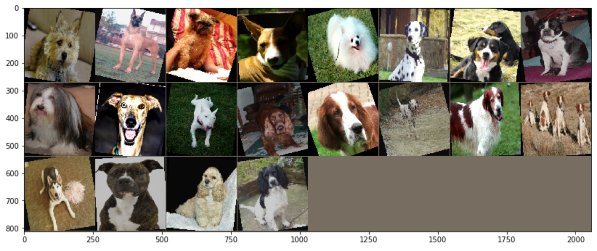

# Simple Classifier
This project creates a simple dog breed classifier using Convolutional
Neural Networks. All the project's code is available as a 
[Jupyter Notebook](dog_app.ipynb).

### Essential Concepts
This repository explores essential neural network-based techniques
for recognizing objects in images. It explores the use of a
succession of convolutional layers that progressivelly add more
channels to the input image and then converging into a series
of dense layers. This is a very similar idea to many of the 
winning architectures in the ImageNet competition.

We also explore how to use pre-trained networks as a starting
point, adapting some aspects of their structure to match our
problem. This is a very interesting approach because we can
use competition-winning networks (e.g. VGG16, ResNet50) as a 
complex feature-extraction system, and then train our neural network
on top of that. This latter approach--commonly referred to as 
"transfer learning"--is what yields the best results in the
scope of this exercise.
